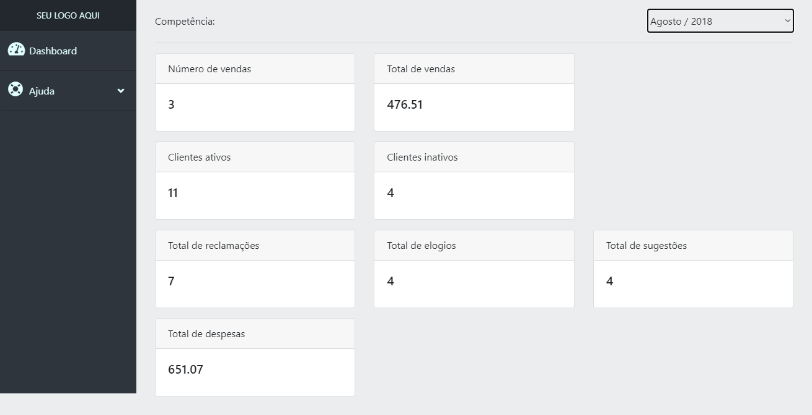

# Dashboard

Aplicativo Dashboard. Criado para fins de prática e treino.

Siga as instruções para o funcionamento do aplicativo: 
Utilizar um servidor para subir a aplicação;
Insira todas as intruções do arquivo querys.sql dentro de um sgdb;
No arquivo app.php, nas linhas 30 a 33, altere os valores das variáveis de conexão com o banco de dados de acordo com qual servidor você usará.
